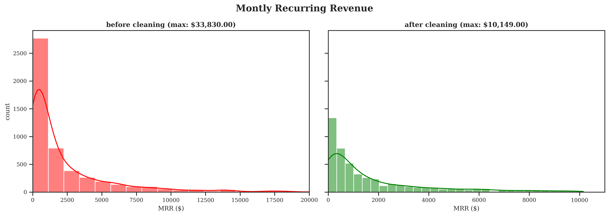
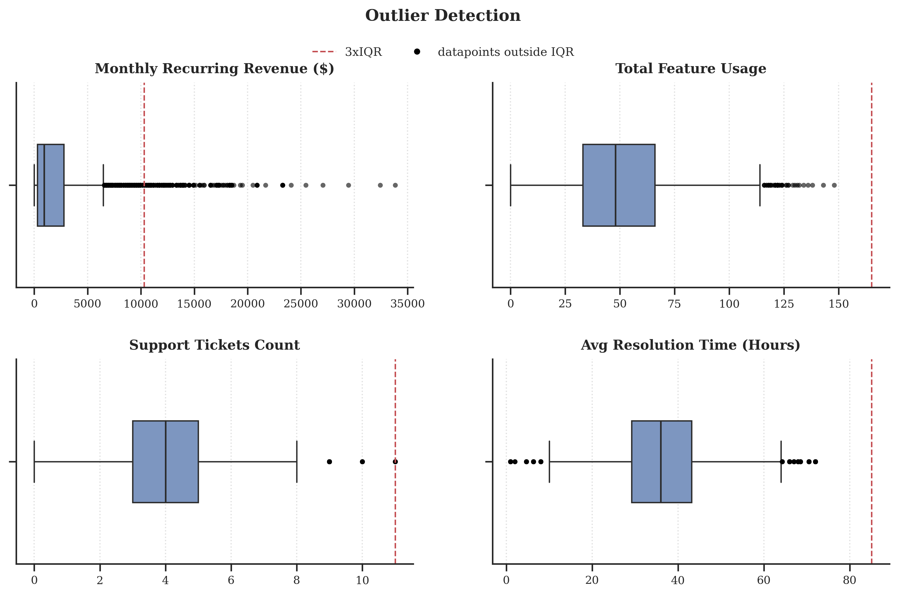
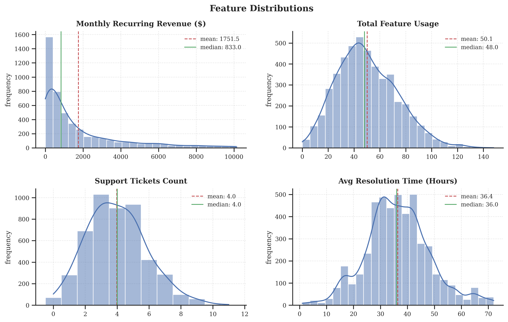
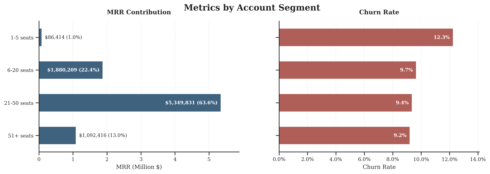
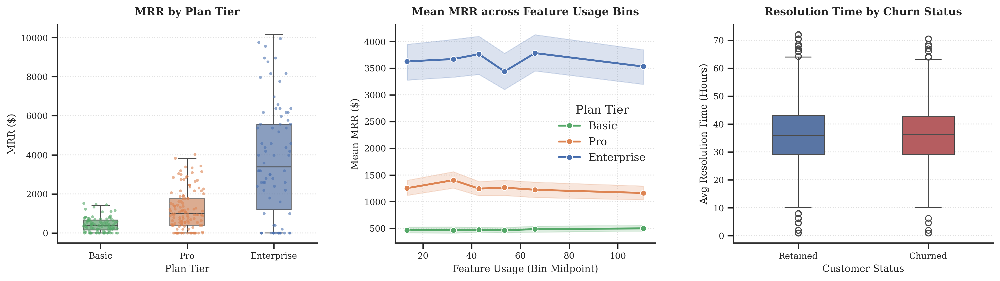

# EDA_SaaS_Subscription_Churn_Analytics
Exploratory Data Analysis (EDA) of the SaaS Subscription &amp; Churn Analytics Dataset. 

The dataset is downloadable [here](https://www.kaggle.com/datasets/rivalytics/saas-subscription-and-churn-analytics-dataset) (accessed August 16th, 2026). The synthetic dataset was generated using ChatGPT and custom Python scripts that simulate real-world SaaS logic with realistic randomness. It includes referential integrity across foreign keys, statistically plausible values (e.g., exponential seat distributions, Poisson usage), and purposeful edge cases like mid-cycle upgrades, missing feedback, and reactivation after churn.


## Overview & Objectives

We analyze subscription lifecycle dynamics, user engagement, customer support interactions, and revenue behaviour within a SaaS ecosystem. The analysis will identify key drivers of customer churn and evaluate account segmentation impact. 


## Requirements


```

pandas
numpy
matplotlib
seaborn
scipy

```

Install dependencies with:
```bash
pip install -r requirements.txt

```


## Data 
We have five CSV files for our data:
* `ravenstack_accounts.csv`
* `ravenstack_subscriptions.csv`
* `ravenstack_feature_usage.csv`
* `ravenstack_support_tickets.csv`
* `ravenstack_churn_events.csv`

### Feature Aggregation
* **Usage Telemetry**: Summarized into `total_usage_count`, converted duration to minutes (`total_usage_duration_min`), and computed total error encounters (`total_error_count`) per `subscription_id`.
* **Support Ticket Telemetry**: Calculated total ticket volume (`total_tickets`), average resolution time in hours (`avg_resolution_hours`), average satisfaction score (`avg_satisfaction_score`), and total escalations (`total_escalations`) per `account_id`.
* **Account Tiering**: Segmented seat counts into explicit size brackets: `Micro (1-5)`, `Small (6-20)`, `Medium (21-50)`, and `Enterprise (50+)`.
* **Imputation**: Left-joined features to the primary subscription base (5,000 records, 25 features) and filled missing usage/support features with `0` to represent inactive or zero-touch users.


## Exploratory Data Analysis 

### Data Cleaning

Understanding feature distributions before and after preprocessing ensures dataset integrity and prevents distortion from missing telemetry data.



Imputing zero values for non-interactive accounts maintained the natural right-skewed distribution of usage and support telemetry without introducing artificial bias into active subscription baselines.


### Outlier Detection & Anomaly Analysis

Identifying operational extremes across seat counts, usage duration, and ticket volumes isolates legitimate power users from data anomalies.



Outliers are predominantly concentrated in Enterprise-tier accounts with large seat volumes and extreme ticket resolution delays, highlighting critical service delivery edge cases that heavily impact retention.


### Descriptive Statistics & Baseline Distributions

Core statistical properties provide baseline insight into subscriber engagement and financial performance.



Monthly Recurring Revenue (MRR) clusters tightly around standard pricing tiers, whereas usage duration and error exposure follow exponential distributions typical of SaaS platform activity.


### Account Segmentation & Scale Dynamics

Categorizing accounts by seat count evaluates how organizational scale influences subscription outcomes and revenue contribution.



`Micro` and `Small` tiers make up the vast majority of account volume. However, churn propensity is inversely related to account scale; smaller tiers churn at a substantially higher rate due to lower organizational switching costs.


### Bivariate Analysis & Churn Drivers

Cross-analyzing key behavioral variables against account churn isolates specific operational friction points.



High usage duration serves as a strong retention anchor. Conversely, elevated software error rates (`total_error_count`) combined with delayed ticket resolutions act as strong leading indicators of customer churn.


### Correlation Matrix & Feature Interdependencies

Evaluating global correlations reveals key relationships between engagement, customer satisfaction, and cancellation events.


Customer churn exhibits the strongest positive correlations with `total_error_count` and `total_escalations`, while showing strong inverse correlations with `avg_satisfaction_score` and `total_usage_duration_min`.


## Summary of Key Results

| Metric Category | Key Observation | Strategic Insight |
| :--- | :--- | :--- |
| **Data Integrity** | Telemetry distributions exhibit natural right-skew; zero-imputation models inactive accounts cleanly. | Zero-touch users must be flagged early in the onboarding cycle. |
| **Account Tiering** | Micro (1–5 seats) and Small (6–20 seats) form the largest customer volume. | Churn is inversely proportional to seat size; automated onboarding is crucial for smaller tiers. |
| **Product Usage** | Usage duration correlates with retention; frequent error encounters correlate with churn. | Technical friction directly degrades usage depth prior to cancellation. |
| **Support Performance** | Ticket escalations and CSAT < 3.0 correlate directly with cancellations. | Escalation management and resolution speed are critical retention drivers for larger accounts. |


## Repository Structure

```
.
├── data/
│   ├── ravenstack_accounts.csv
│   ├── ravenstack_churn_events.csv
│   ├── ravenstack_feature_usage.csv
│   ├── ravenstack_subscriptions.csv
│   └── ravenstack_support_tickets.csv
├── figures/
│   ├── 
├── 
└── README.md

```


